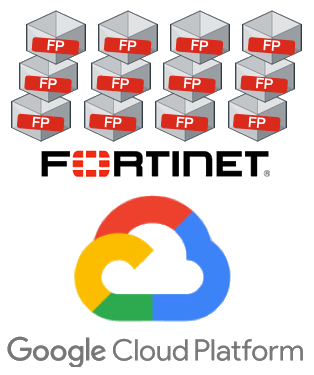
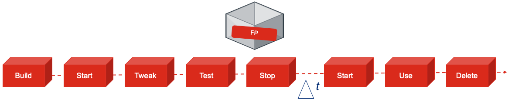
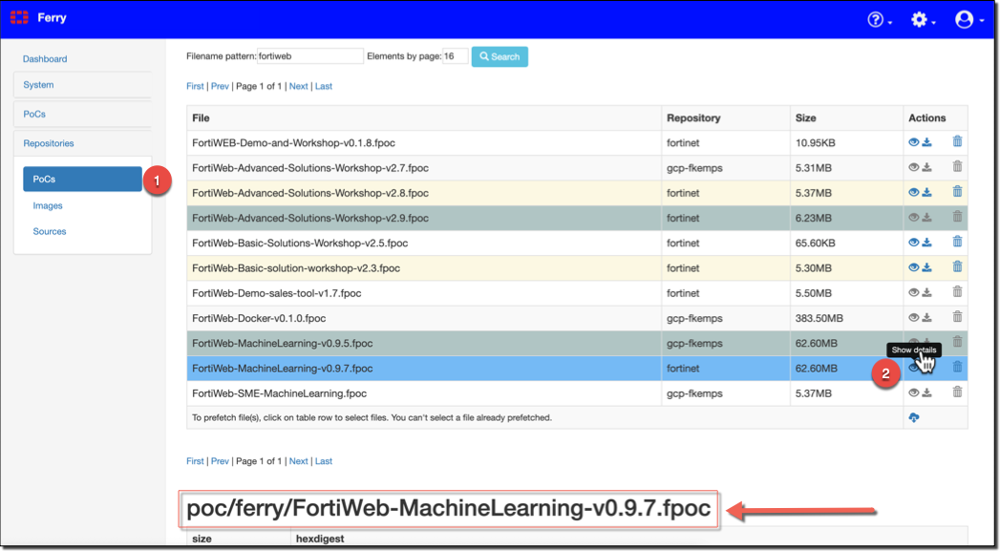

# FortiPoC Toolkit for Google Cloud Platform

<p align="center">
  
</p>

Manage and configure FortiPoC instances on Google Cloud Platform (GCP).   
This toolkit (scripts) allow you to manage the workload of creating, configuring, publishing and deleting FortiPoC instances in a consitent and easy way.

The toolkit allows you to:

* **Handle GCP instances**: Build, Clone, Delete, Global publish, Machine-type change, List, Listpubip, Start, Stop (gcpcmd.sh)
* **Tweak FortiPoC's**: Make config changes on running FortiPoC instances (fpoc-to-all.sh)



## Prerequisites
You will need access to GCP and prepare your local environment

* Active GCP account
* Subscription to your private or company project (billing)
* Computer system capable of running bash shell e.g. Linux, MacOs or Windows + Cygwin/Bash-on-Windows10
* Locally installed `GCP SDK` ([Installing Google Cloud SDK](https://cloud.google.com/sdk/install))
* Locally installed program `parallel` ([Install parallel on Mac OSX](http://macappstore.org/parallel/)) (Linux: apt install parallel)
* Locally installed program `jq` ([Install jq on Mac OSX](https://brewinstall.org/install-jq-on-mac-with-brew/)) (Linux: apt install jq)

## Obtaining Scripts
You can obtain the latest releases of the scripts from GitHub [https://github.com/fkemps/FortiPoC-Toolkit-for-GCP.git](https://github.com/fkemps/FortiPoC-Toolkit-for-GCP.git)

## Install
No package installation is needed besides those listed in the prerequisites section.   
Preferred installation method is per git clone. That allows easy installation of updates afterwards with `git pull` while in the FortiPoC-Toolkit-for-GCP directory. (There is a new version indication)

Go to your preferred working directory and pull the environment.

`git clone https://github.com/fkemps/FortiPoC-Toolkit-for-GCP.git`

Make sure you installed the prerequisite programs and start basis setup:

* `gcloud init`, and logout/login
* `parallel --citation`, and enter `will cite`

### Directory and file
The directory structure and files explained

```
 0 drwxr-xr-x  15 fkemps  staff   480B Nov  1 16:22 conf                   << Directory holding fpoc-xxxxx.conf files
 8 -rw-r--r--   1 fkemps  staff   587B Nov  1 16:41 fpoc-example.conf      << Config example created by -b option
16 -rwxr-xr-x   1 fkemps  staff   5.2K Nov  1 16:10 fpoc-to-all.sh         << FortiPoC config tweaking script
32 -rwxr-xr-x   1 fkemps  staff    12K Nov  1 16:40 gcpcmd.sh              << Handling instances on GCP
 0 drwxr-xr-x  30 fkemps  staff   960B Nov  1 21:29 logs                   << Directory holding build log files
```

### Google Cloud Plaftorm preparation
**FortiPoC VM image**   
If you need to deploy your FortiPoC in a GCP project where the FortiPoC image is not available yet, you need to type the commands below because GCP only accepts tar.gz of a raw disk.

```
qemu-img dd -f vmdk -O raw bs=4M count=1K if=fortipoc.vmdk of=disk.raw
tar -cvzf fortipoc-VER.tar.gz disk.raw
gsutil cp fortipoc-VER.tar.gz gs://YOUR_BUCKET/
gcloud compute images create fortipoc-VER \
  --project=YOUR_PROJECT \
  --source-uri gs://YOUR_BUCKET/fortipoc-VER.tar.gz \
  --licenses "https://www.googleapis.com/compute/v1/projects/vm-options/global/licenses/enable-vmx" \
  --family fortipoc
```

To start FortiPoC in GCP you need either to add an extra disk or to tell GCP that you want to extend the 4GB base image to the size you need (64GB is a minimum). The second solution is easier if you plan to build golden images of your PoCs.

Alternatively you could ask me for an image to upload to GCP.

Create a compute image per:

```
gcloud compute images create "fortipoc-1714-test" --project=project-name \
--source-uri gs://fortipoc_bucket/fortipoc-1.7.14-clear.tar.gz \
--licenses "https://www.googleapis.com/compute/v1/projects/vm-options/global/licenses/enable-vmx" --family fortipoc
```

**Security**   
To allow controlled access to the FortiPoC instances we protect it with firewall-rules.   
Two INGRESS firewall-rules are automatically created and used to control access from specific IP/subnets (workshop-source-networks) and global access (workshop-source-any) to the following ports:

* TCP: 22, 80, 443, 8000, 8080, 8888, :10000-20000, 20808, 20909, 22222
* UDP: 53, 514, 1812, 1813

By default access to FortiPoC instances is disabled and need to be enabled manually. This can be done by either adding IP/subnets (--ip-address-add) or enabling global access (--global-access-enable) plus configuring instances for global access.


# Handle GCP Instanced (*gcpcmd.sh*)

### Configure
Configuration will start automatically on first usage of gcpcmd.sh, or after using `gcpcmd.sh -d | --delete-config`.   

The user default settings are stored in `~/.fpoc/gcpcmd.conf`

As part of the configuration you need to have your **GCP Project ID**. This can be obtain via `gcloud projects list` and is listed as PROJECT_ID.

```
-------------------------------------------------------
 Welcome to FortiPoc Toolkit for Google Cloud Platform
-------------------------------------------------------

This is your first time use of gcpcmd.sh and no preferences are set. Let's set them!
NOTE: Make sure you have enabled the 'Compute Engine API' via the Google Cloud Console first!
Would you like to have gcpcmd as a global command? y/n :

Your initials e.g. fl                       : fl
Your name to lable instanced e.g. flastname : flastname <<=== firstname letter + lastname
Groupname for shared instances (optional)   : teamwork
Your region 1) Asia, 2) Europe, 3) America  : 2
You have access to the following GCP Projects
  0) : "dummy1"
  1) : "dummy2"

 Select your GCP project : 1
Provide your GCP service account (only one if multiple shown) [00000000-compute@developer.gserviceaccount.com] :
IP-address of FortiPoC license server (if available) :
Provide your SSH public key for FortiPoC access [ssh-rsa <value>] :
```

### Build Config Template
To create an example config file you can issue `./gcpcmd.sh -b`. This will create a fpoc-example.conf template file which can be use to create workload specific config files.

Copy fpoc-example.conf to conf directory with an descriptive name for your workload. You will need this file for the Build option via -b conf/fpoc-fwb-workshop.conf as an example.

```
# Uncomment and speficy to override user defaults
#GCPPROJECT="cse-projects-000000"
#GCPSERVICEACCOUNT="000000000-compute@developer.gserviceaccount.com"
#FPPREPEND="fl"
#LABELS="fortipoc=,owner=flastname"
#LICENSESERVER=""

# --- edits below this line ---
# Specify FortiPoC instance details.
MACHINETYPE="n1-standard-4"
FPIMAGE="fortipoc-1-7-14-clear"
#FPSIMPLEMENU="enable"
FPTRAILKEY='ES-xamadrid-201907:765eb11f6523382c10513b66a8a4daf5'
#GCPREPO=""
#FPGROUP="flastname"
POCDEFINITION1="poc/ferry/FortiWeb-Basic-solution-workshop-v2.2.fpoc"
#POCDEFINITION2="poc/ferry/FortiWeb-Advanced-Solutions-Workshop-v2.5.fpoc"
#POCDEFINITION3=""
#POCDEFINITION4=""
#POCDEFINITION5=""
#POCDEFINITION6=""
#POCDEFINITION7=""
#POCDEFINITION8=""
#POCLAUNCH="FortiWeb Basic solutions"
```

* The POCDEFINITION name can be obtained from the available POC-definitions on the repositories.



## Managing FortiPoC instances
To control the FortiPoC instances you can use the `gcpcmd.sh` script.   
This allows you to **Build**, **Clone**, **Start**, **Stop**, **Delete** and **list** FortiPoC instances.

`./gcpcmd.sh`

```

 _____          _   _ ____              _____           _ _    _ _      __               ____  ____ ____
|  ___|__  _ __| |_(_)  _ \ ___   ___  |_   _|__   ___ | | | _(_) |_   / _| ___  _ __   / ___|/ ___|  _ \
| |_ / _ \|  __| __| | |_) / _ \ / __|   | |/ _ \ / _ \| | |/ / | __| | |_ / _ \|  __| | |  _| |   | |_) |
|  _| (_) | |  | |_| |  __/ (_) | (__    | | (_) | (_) | |   <| | |_  |  _| (_) | |    | |_| | |___|  __/
|_|  \___/|_|   \__|_|_|   \___/ \___|   |_|\___/ \___/|_|_|\_\_|\__| |_|  \___/|_|     \____|\____|_|
(Version: 2024080201)

Selected project : fkemps-cse-labs
Default deployment region: europe-west3-a
Personal instance identification: fk
Default product: event

Usage: /usr/local/bin/gcpcmd [OPTIONS] [ARGUMENTS]
       /usr/local/bin/gcpcmd [OPTIONS] <region> <product> <action>
       /usr/local/bin/gcpcmd [OPTIONS] <-b configfile> <region> <product> build
       /usr/local/bin/gcpcmd [OPTIONS] [region] [product] list
       /usr/local/bin/gcpcmd [OPTIONS] [region] [product] listpubip
OPTIONS:
        -b    --build-file                     File for building instances. Leave blank to generate example
        -d    --delete-config                  Delete default user config settings
        -g    --group                          Group name for shared instances
        -ge   --global-access-enable           Enable glocal access to instances
        -gd   --global-access-disable          Disable glocal access to instances
        -gl   --global-access-list             List global access to instances (network tags)
        -gs   --global-access-status           Status glocal access to instances
        -i    --initials <initials>            Override intials on instance name for group management
        -ia   --ip-address-add [IP-address]    Add current public IP-address to GCP ACL
        -ir   --ip-address-remove [IP-address] Remove current public IP-address from GCP ACL
        -il   --ip-address-list                List current public IP-address on GCP ACL
        -lg   --list-global                    List all your instances globally
        -ll   --list-labels                    List all your instances and labels
        -lr   --list-running                   List all your instances in RUNNING state
        -p    --preferences                    Show personal config preferences
        -pa   --project-add                    Add GCP project to preferences
        -ps   --project-select                 Select project on GCP
        -t    --type                           Override default type name (fpoc)
        -ui   --upload-image                   Upload image to build an instance
        -z    --zone                           Override default region zone
ARGUMENTS:
       region  : america, asia, europe
       product : appsec, fad, fpx, fsa, fsw, fwb, sme, test, xa or <custom-name>
       action  : accesslist, accessmodify, build*, clone, delete, globalaccess, labellist, labelmodify
                 list, listpubip, machinetype, move, rename, start, stop

                *action build needs -b <conf/configfile>. Use ./gcpcmd.sh -b to generate fpoc-example.conf file

```

### Build
Building will be fully automatic per specified config file. Each FortiPoC will be provisioned in parallel and download all needed VM-images and documentation. This will cause a high download on FortiPoC repository and the more you deploy in parallel the longer it will take. Advice is to not provision more then 10 simultaniously. Do it in batches or build just one and use the `clone` function to duplicate which will be much faster.

Good practice is to have a config file per environment e.g. testing, workshop, seminars, products or solutions. For example `conf/fpoc-apac-se-fwb-ws.conf`, `conf/fpoc-emea-xa-fad-ws.conf`, `conf/fpoc-project-demo.conf`.

FortiPoC's will be running with e.g. PoC-definitions loaded, VM-images and documentation prefetched, guest/guest account enabled, GUI title set and optionally a PoC-definition launched.

`./gcpcmd.sh -b conf/fpoc-test.conf europe test build`

```
---------------------------------------------------------------------
             FortiPoC Toolkit for Google Cloud Platform
---------------------------------------------------------------------

 Enter amount of FortiPoC's : 3
 Enter start of numbered range : 1

Okay to build fpoc-fk-test-001 till fpoc-fk-test-003, Project=dummy, region=europe-west4-a.   y/n? y
==> Lets go...using Owner=fkemps or Group=fkemps, Project=dummy, Zone=europe-west4-a, Product=test, Action=build
==> Sleeping 1s seconds to avoid GCP DB locking
==> Creating instance fpoc-fk-test-003
NAME              ZONE            MACHINE_TYPE   PREEMPTIBLE  INTERNAL_IP  EXTERNAL_IP  STATUS
fpoc-fk-test-003  europe-west4-a  n1-standard-4               10.164.0.64  34.90.88.37  RUNNING

==> Sleeping 90 seconds to allow FortiPoC booting up
fpoc-fk-test-003 = 34.90.88.37
FortiPoC fpoc-fk-test-003 on 34.90.88.37 reachable
==> Registering FortiPoC
Boot installation:
1/ Preparing host
2/ Mounting disks
- Preparing resources disk
- Preparing local repository
- Enabling SWAP
3/ Validating DB
- Building en_US locale(s)
- Set default LANG to en_US.UTF-8
- Migrating
- Preparing default values
- Apply default settings
- Generating default configuration
- Defining users permissions
- Analyzing host hardware
  synciface
  hoststate
  virtcpu
  complete
4/ Enabling interfaces
- Enabling /etc/network/interfaces.d/eth0
5/ Enabling WebUI
- Start WebUI
6/ L0 Hypervisor tasks
registered
==> Setting title
==> Setting licenseserver
==> Prefetching all images and documentation
==> End of Build phase <==
<other output skipped>
```

Output for all FortiPoC builds will by provided once finished build phase.

### Clone
The clone function allows you to clone a FortiPoC (GCP instance) one or multiple times in parallel. The operational state of FortiPoC doesn't matter, it can be `Terminated` or `Running` for example. If you're *"better safe than sorry"* then first stop the FortiPoC instance you whish to clone.

You can use first the `build` function to provision a FortiPoC, tweak as wanted with `fpoc-to-all.sh` and clone it to the amount you need. Use `list` function to see which FortiPoC instances are available to clone and their numbering.

`./gcpcmd.sh europe test clone`

```
---------------------------------------------------------------------
             FortiPoC Toolkit for Google Cloud Platform
---------------------------------------------------------------------

 FortiPoC instance number to clone : 1
 Enter amount of FortiPoC's clones : 15
 Enter start of numbered range : 2

Okay to clone fpoc-fk-test-001 to fpoc-fk-test-002 till fpoc-fk-test-016, Project=dummy, region=europe-west4-a.   y/n?
Do you want to create a fresh snapshot? (If no, latest snapshot will be used if available) y/n:
Creating snapshot(s) fpoc-fk-test...done.
==> Lets go...using Owner=fkemps or Group=demo, Project=dummy, Zone=europe-west2-a, Product=test, Action=clone

==> Sleeping 6s seconds to avoid GCP DB locking
==> Cloning instance fpoc-fk-test-001 to fpoc-fk-test-002
==> Creating disk for fpoc-fk-test-002
NAME              ZONE            SIZE_GB  TYPE         STATUS
fpoc-fk-test-002  europe-west4-a  200      pd-standard  READY
==> Create instance fpoc-fk-test-002
NAME              ZONE            MACHINE_TYPE   PREEMPTIBLE  INTERNAL_IP  EXTERNAL_IP   STATUS
fpoc-fk-test-002  europe-west4-a  n1-standard-4               10.164.0.38  34.90.151.94  RUNNING
```

### Delete

`./gcpcmd.sh europe test delete`

```
---------------------------------------------------------------------
             FortiPoC Toolkit for Google Cloud Platform
---------------------------------------------------------------------

 Enter amount of FortiPoC's : 3
 Enter start of numbered range : 1

Okay to delete fpoc-fk-test-001 till fpoc-fk-test-003, Project=dummy, region=europe-west4-a.   y/n? y
==> Lets go...using Owner=fkemps or Group=demo, Project=dummy, Zone=europe-west2-a, Product=test, Action=delete

==> Deleting instance fpoc-fk-test-002
The following instances will be deleted. Any attached disks configured
 to be auto-deleted will be deleted unless they are attached to any
other instances or the `--keep-disks` flag is given and specifies them
 for keeping. Deleting a disk is irreversible and any data on the disk
 will be lost.
 - [fpoc-fk-test-002] in [europe-west4-a]

Do you want to continue (Y/n)?
Deleted [https://www.googleapis.com/compute/v1/projects/cse-projects-202906/zones/europe-west4-a/instances/fpoc-fk-test-002].
==> Deleting instance fpoc-fk-test-001
The following instances will be deleted. Any attached disks configured
 to be auto-deleted will be deleted unless they are attached to any
other instances or the `--keep-disks` flag is given and specifies them
 for keeping. Deleting a disk is irreversible and any data on the disk
 will be lost.
 - [fpoc-fk-test-001] in [europe-west4-a]

Do you want to continue (Y/n)?
Deleted [https://www.googleapis.com/compute/v1/projects/cse-projects-202906/zones/europe-west4-a/instances/fpoc-fk-test-001].
==> Deleting instance fpoc-fk-test-003
The following instances will be deleted. Any attached disks configured
 to be auto-deleted will be deleted unless they are attached to any
other instances or the `--keep-disks` flag is given and specifies them
 for keeping. Deleting a disk is irreversible and any data on the disk
 will be lost.
 - [fpoc-fk-test-003] in [europe-west4-a]

Do you want to continue (Y/n)?
Deleted [https://www.googleapis.com/compute/v1/projects/cse-projects-202906/zones/europe-west4-a/instances/fpoc-fk-test-003].
```

### Global
You can use the globalaccess action to enable/disable FortiPoC instances for glolbal access. This will add the firewall-rule to allow/deny INGRESS traffic from any IP-address.

`./gcpcmd.sh europe test globalaccess`

```
---------------------------------------------------------------------
             FortiPoC Toolkit for Google Cloud Platform
---------------------------------------------------------------------

 Enter amount of FortiPoC's : 10
 Enter start of numbered range : 1
 select world wide access : 1) Enable, 2) Disable : 1

Okay to globalaccess fpoc-fk-test-001 till fpoc-fk-test-010, Project=dummy, region=europe-west4-a.   y/n?
```

You can use following options to enable/disable the global firewall-rule, obtain current status and show configured firewall-rules per instance.

`-ge  | --global-access-enable`           Enable glocal access to instances
`-gd  | --global-access-disable`          Disable glocal access to instances
`-gl  | --global-access-list`             List global access to instances
`-gs  | --global-access-status`           Status glocal access to instances

#### Network tags (firewall-rules)
The accesslist action can be used to list the network tags (firewall-rules) applied to the selected FortiPoC instances.

`./gcpcmd-new.sh europe test globalaccesslist`

```
---------------------------------------------------------------------
             FortiPoC Toolkit for Google Cloud Platform
---------------------------------------------------------------------

 Enter amount of FortiPoC's : 8
 Enter start of numbered range : 8

Okay to accesslist fpoc-fk-test-008 till fpoc-fk-test-015, Project=dummy, region=europe-west4-a.   y/n? y
==> Lets go...using Owner=fkemps or Group=demo, Project=dummy, Zone=europe-west4-a, Product=test, Action=accesslist

Listing network tags (firewall rules) of all instances

Instancename    : network tags
---------------------------------------------------------------------------------
fpoc-fk-test-008 : fortipoc-deny-default fortipoc-http-https-redir workshop-source-any workshop-source-networks
fpoc-fk-test-009 : fortipoc-deny-default fortipoc-http-https-redir workshop-source-any workshop-source-networks
fpoc-fk-test-010 : fortipoc-deny-default fortipoc-http-https-redir workshop-source-any workshop-source-networks
fpoc-fk-test-011 : fortipoc-deny-default fortipoc-http-https-redir workshop-source-any workshop-source-networks
fpoc-fk-test-012 : fortipoc-deny-default fortipoc-http-https-redir workshop-source-any workshop-source-networks
fpoc-fk-test-013 : fortipoc-deny-default fortipoc-http-https-redir workshop-source-any workshop-source-networks
fpoc-fk-test-014 : fortipoc-deny-default fortipoc-http-https-redir workshop-source-any workshop-source-networks
fpoc-fk-test-015 : fortipoc-deny-default fortipoc-http-https-redir workshop-source-any workshop-source-networks
```
### Accessmodify
The accessmodify action can be used to add/remove/replace network tags from the selected instances.

`./gcpcmd-new.sh europe test accessmodify`

* Add   

```
---------------------------------------------------------------------
             FortiPoC Toolkit for Google Cloud Platform
---------------------------------------------------------------------

 Enter amount of FortiPoC's : 2
 Enter start of numbered range : 1
 What network tag action would you like 1) Add, 2) Remove, 3) Replace : 1
 Provide the network tag and value e.g. name=value : purpose=fortipoc

Okay to accessmodify fpoc-fk-test-001 till fpoc-fk-test-002, Project=dummy, region=europe-west2-a.   y/n? y
==> Lets go...using Owner=fkemps or Group=demo, Project=dummy, Zone=europe-west2-a, Product=test, Action=accessmodify

==> Adding network tag purpose=fortipoc to instance fpoc-fk-test-001
==> Adding network tag purpose=fortipoc to instance fpoc-fk-test-002
```

* Remove   

```
---------------------------------------------------------------------
             FortiPoC Toolkit for Google Cloud Platform
---------------------------------------------------------------------

 Enter amount of FortiPoC's : 2
 Enter start of numbered range : 1
 What network tag action would you like 1) Add, 2) Remove, 3) Replace : 2
 Provide the network tag name to remove : purpose

Okay to accessmodify fpoc-fk-test-001 till fpoc-fk-test-002, Project=dummy, region=europe-west2-a.   y/n? y
==> Lets go...using Owner=fkemps or Group=demo, Project=dummy, Zone=europe-west2-a, Product=test, Action=accessmodify

==> Removing network tag purpose from instance fpoc-fk-test-001
==> Removing network tag purpose from instance fpoc-fk-test-002
```

* Replace

```
---------------------------------------------------------------------
             FortiPoC Toolkit for Google Cloud Platform
---------------------------------------------------------------------

 Enter amount of FortiPoC's : 2
 Enter start of numbered range : 1
 What network tag action would you like 1) Add, 2) Remove, 3) replace : 3
 Provide the network tag name to replace : purpose
 Provide the new network tag and value e.g. name=value : test=test

Okay to accessmodify fpoc-fk-test-001 till fpoc-fk-test-002, Project=dummy, region=europe-west2-a.   y/n? y
==> Lets go...using Owner=fkemps or Group=demo, Project=dummy, Zone=europe-west2-a, Product=test, Action=accessmodify

==> Replacubg network tag purpose with test=test on instance fpoc-fk-test-001
==> Replacubg network tag purpose with test=test on instance fpoc-fk-test-002
```

### Labellist
The labellist action can be used to list all the labels applied on the selected FortiPoC instances.

`./gcpcmd-new.sh europe test labellist`

```
---------------------------------------------------------------------
             FortiPoC Toolkit for Google Cloud Platform
---------------------------------------------------------------------

 Enter amount of FortiPoC's : 10
 Enter start of numbered range : 1

Okay to labellist fpoc-fk-test-001 till fpoc-fk-test-010, Project=dummy, region=europe-west2-a.   y/n? y
==> Lets go...using Owner=fkemps or Group=demo, Project=dummy, Zone=europe-west2-a, Product=test, Action=labellist

Listing labels of selected instances

Instancename     : labels
---------------------------------------------------------------------------------
fpoc-fk-test-001 : expire=2024-12-31,group=demo,owner=fkemps,purpose=fortipoc
fpoc-fk-test-002 : expire=2024-12-31,group=demo,owner=fkemps,purpose=fortipoc
fpoc-fk-test-003 : expire=2024-12-31,group=demo,owner=fkemps,purpose=fortipoc
fpoc-fk-test-004 : expire=2024-12-31,group=demo,owner=fkemps,purpose=fortipoc
fpoc-fk-test-005 : expire=2024-12-31,group=demo,owner=fkemps,purpose=fortipoc
fpoc-fk-test-006 : expire=2024-12-31,group=demo,owner=fkemps,purpose=fortipoc
fpoc-fk-test-007 : expire=2024-12-31,group=demo,owner=fkemps,purpose=fortipoc
fpoc-fk-test-008 : expire=2024-12-31,group=demo,owner=fkemps,purpose=fortipoc
fpoc-fk-test-009 : expire=2024-12-31,group=demo,owner=fkemps,purpose=fortipoc
fpoc-fk-test-010 : expire=2024-12-31,group=demo,owner=fkemps,purpose=fortipoc
```
### Labelmodify
The labelmodify action can be used to add/remove/replace labels from the selected instances.

`./gcpcmd-new.sh europe test labelmodify`

* Add   

```
---------------------------------------------------------------------
             FortiPoC Toolkit for Google Cloud Platform
---------------------------------------------------------------------

 Enter amount of FortiPoC's : 2
 Enter start of numbered range : 1
 What label action would you like 1) Add, 2) Remove, 3) Replace : 1
 Provide the label and value e.g. name=value : purpose=fortipoc

Okay to labelmodify fpoc-fk-test-001 till fpoc-fk-test-002, Project=dummy, region=europe-west2-a.   y/n? y
==> Lets go...using Owner=fkemps or Group=demo, Project=dummy, Zone=europe-west2-a, Product=test, Action=labelmodify

==> Adding label purpose=fortipoc to instance fpoc-fk-test-001
==> Adding label purpose=fortipoc to instance fpoc-fk-test-002
```

* Remove   

```
---------------------------------------------------------------------
             FortiPoC Toolkit for Google Cloud Platform
---------------------------------------------------------------------

 Enter amount of FortiPoC's : 2
 Enter start of numbered range : 1
 What label action would you like 1) Add, 2) Remove, 3) Replace : 2
 Provide the label name to remove : purpose

Okay to labelmodify fpoc-fk-test-001 till fpoc-fk-test-002, Project=dummy, region=europe-west2-a.   y/n? y
==> Lets go...using Owner=fkemps or Group=demo, Project=dummy, Zone=europe-west2-a, Product=test, Action=labelmodify

==> Removing label purpose from instance fpoc-fk-test-001
==> Removing label purpose from instance fpoc-fk-test-002
```

* Replace

```
---------------------------------------------------------------------
             FortiPoC Toolkit for Google Cloud Platform
---------------------------------------------------------------------

 Enter amount of FortiPoC's : 2
 Enter start of numbered range : 1
 What label action would you like 1) Add, 2) Remove, 3) replace : 3
 Provide the label name to replace : purpose
 Provide the new label and value e.g. name=value : test=test

Okay to labelmodify fpoc-fk-test-001 till fpoc-fk-test-002, Project=dummy, region=europe-west2-a.   y/n? y
==> Lets go...using Owner=fkemps or Group=demo, Project=dummy, Zone=europe-west2-a, Product=test, Action=labelmodify

==> Replacubg label purpose with test=test on instance fpoc-fk-test-001
==> Replacubg label purpose with test=test on instance fpoc-fk-test-002
```

### List
Full overview of FortiPoC's can be obtained with **list** function. Specify *region*, *product* and *list*.

`./gcpcmd.sh europe test list`

```
---------------------------------------------------------------------
             FortiPoC Toolkit for Google Cloud Platform
---------------------------------------------------------------------

==> Lets go...using Owner=fkemps or Group=fkemps, Project=dummy, Zone=europe-west4-a, Product=test, Action=list

NAME              ZONE            MACHINE_TYPE   PREEMPTIBLE  INTERNAL_IP  EXTERNAL_IP    STATUS
fpoc-fk-test-001  europe-west4-a  n1-standard-4               10.164.0.66  34.90.107.239  RUNNING
fpoc-fk-test-002  europe-west4-a  n1-standard-4               10.164.0.65  34.90.90.164   RUNNING
fpoc-fk-test-003  europe-west4-a  n1-standard-4               10.164.0.64  34.90.88.37    RUNNING
```

FortiPoC IP-addresses can be obtained to use for `fpoc-to-all.sh` usage.

`./gcpcmd.sh europe test listpubip`

```
---------------------------------------------------------------------
             FortiPoC Toolkit for Google Cloud Platform
---------------------------------------------------------------------

==> Lets go...using Owner=fkemps or Group=fkemps, Project=dummy, Zone=europe-west4-a, Product=test, Action=listpubip

34.90.107.239 34.90.90.164 34.90.88.37
```

### Machinetype

You can change the machine-type to adjust CPU/Memory of the instance on GCP.

`./gcpcmd.sh europe test machinetype`

```
---------------------------------------------------------------------
             FortiPoC Toolkit for Google Cloud Platform
---------------------------------------------------------------------

 Enter amount of FortiPoC's : 20
 Enter start of numbered range : 1
 select machine-type : 1) n1-standard-1, 2) n1-standard-2, 3) n1-standard-4, 4) n1-standard-8, 5) n1-standard-16 : 2

Okay to machinetype fpoc-fk-test-001 till fpoc-fk-test-020, Project=dummy, region=europe-west4-a.   y/n?
```

### Start / Stop

`./gcpcmd.sh europe test start` or `./gcpcmd.sh europe test stop`

```
---------------------------------------------------------------------
             FortiPoC Toolkit for Google Cloud Platform
---------------------------------------------------------------------

 Enter amount of FortiPoC's : 2
 Enter start of numbered range : 1

Okay to stop fpoc-fk-test-001 till fpoc-fk-test-002, Project=dummy, region=europe-west4-a.   y/n? y
==> Lets go...using Owner=fkemps or Group=demo, Project=dummy, Zone=europe-west2-a, Product=test, Action=stop

==> Stopping instance fpoc-fk-test-001
Stopping instance(s) fpoc-fk-test-001...
..............................................................................................................................................................................................................................done.
Updated [https://compute.googleapis.com/compute/v1/projects/cse-projects-202906/zones/europe-west4-a/instances/fpoc-fk-test-001].
==> Stopping instance fpoc-fk-test-002
Stopping instance(s) fpoc-fk-test-002...
..........................................................................................................................................................................................................................................done.
Updated [https://compute.googleapis.com/compute/v1/projects/cse-projects-202906/zones/europe-west4-a/instances/fpoc-fk-test-002].
```


#### Allow / Deny access to FortiPoC
The FortiPoC's deployed are by default **not** reachable from the internet.   
You can allowed/denied access to the FortiPoC's by simply running `gcpcmd.sh -ip-address-add` or `gcpcmd.sh --ip-address-remove` respectively while you're connected onto the location network. It will automatically obtain your public IP-address and add/remove it to the GCP firewall rule-set.

`./gcpcmd.sh --ip-address-add`

By adding [IP-ADDRESS] argument you can specify which IP-address to add/remove.

`./gcpcmd.sh --ip-address-add 10.1.1.1`

```
Adding public-ip 10.1.1.1 to GCP ACL to allow access from this location
Updated [https://www.googleapis.com/compute/v1/projects/cse-projects-202906/global/firewalls/workshop-source-networks].
Current GCP ACL list
80.60.25.77/32
121.7.171.108
94.210.222.83
87.69.50.141
88.151.153.107
109.144.211.50
88.151.153.101
195.228.28.243
85.88.130.222
193.126.247.194
62.48.251.38
195.76.37.24
146.88.49.66
91.126.136.150
91.126.136.155
219.74.227.60
82.217.133.158
85.88.152.134
85.138.76.14
188.37.53.177
77.54.220.220
62.28.181.26
85.139.134.54
118.201.61.6
146.185.63.130
85.251.147.205
203.172.126.3
10.1.1.1
```

To retrieve the public IP-addresses on the GCP ACL you can use

`./gcpcmd.sh --ip-address-list`

```
Listing public-ip addresses on GCP ACL
80.60.25.77/32
121.7.171.108
94.210.222.83
87.69.50.141
88.151.153.107
109.144.211.50
88.151.153.101
195.228.28.243
85.88.130.222
193.126.247.194
62.48.251.38
195.76.37.24
146.88.49.66
91.126.136.150
91.126.136.155
219.74.227.60
82.217.133.158
85.88.152.134
85.138.76.14
188.37.53.177
77.54.220.220
85.139.134.54
118.201.61.6
146.185.63.130
85.251.147.205
203.172.126.3
10.1.1.1
```

#### Listing your instances
`./gcpcmd.sh --list-global` will list all your instances of which you're the owner or from your group.

```
---------------------------------------------------------------------
             FortiPoC Toolkit for Google Cloud Platform
---------------------------------------------------------------------

Listing all global instances for Project:dummy-project Owner:fkemps or Group:demo

NAME              ZONE            MACHINE_TYPE   PREEMPTIBLE  INTERNAL_IP  EXTERNAL_IP    STATUS
fpoc-fk-test-001  europe-west4-a  n1-standard-4               10.164.0.60  34.90.228.152  RUNNING
fpoc-fk-test-002  europe-west4-a  n1-standard-4               10.164.0.59  34.90.81.85    RUNNING
fpoc-fk-test-003  europe-west4-a  n1-standard-4               10.164.0.58  34.90.81.86    TERMINATED
fpoc-fk-test-004  europe-west4-a  n1-standard-4               10.164.0.57  34.90.81.87    TERMINATED
```

`./gcpcmd.sh --list-running` will list all your running instances of which you're the owner or from your group.

```
---------------------------------------------------------------------
             FortiPoC Toolkit for Google Cloud Platform
---------------------------------------------------------------------

Listing all global RUNNING instances for Project:dummy-project Owner:fkemps or Group:demo

NAME              ZONE            MACHINE_TYPE   PREEMPTIBLE  INTERNAL_IP  EXTERNAL_IP    STATUS
fpoc-fk-test-001  europe-west4-a  n1-standard-4               10.164.0.60  34.90.228.152  RUNNING
fpoc-fk-test-002  europe-west4-a  n1-standard-4               10.164.0.59  34.90.81.85    RUNNING
```


#### Manage your instances with a group
`./gcpcmd.sh --group <groupname>` allows you to view, control and build instances with a group label.   
The `-g` ro `--group` option can be specified after gcpcmd.sh command in any order and will override the stored perferences and config-template group definition.
Order of group preferences is personal, config-template and command-option.

### Multi-project feature

#### Add GCP project
`./gcpcmd.sh --project-add` will allow you to add a GCP project to your preferences definitions.

```script
Provide your initials e.g. fl : jd
Provide your name to lable instanced e.g. flastname : jdoe
Provide a groupname for shared instances (optional) : clowns
Provide your region 1) Asia, 2) Europe, 3) America : 1
Project ID's found on GCP
dummy1
dummy2
Provide your GCP Project ID : dummy2
Provide your GCP service account (only one if multiple shown) [1234567890-compute@developer.gserviceaccount.com] :
IP-address of FortiPoC license server (if available) : 10.10.10.10
Provide your SSH public key for FortiPoC access (optional) [ssh-rsa ARBCDEDGHIJKLMNOPQRSTUVWXYZAAAB3NzaC1yc2EAAAADA....1234567890 jdoe@JD-MacBook.local] :
```
#### Project select
You can select the GCP project to work on from your preferences.

`./gcpcmd.sh --project-select` will allow you to select your defined GCP projects

```script
--------------------------------------------------------------------------
 Current project    : dummy1
 Number of projects : 2
 All projects       : dummy1 dummy2
--------------------------------------------------------------------------

  1) : dummy1
  2) : dummy2

 Select your GCP project : 2
 Project "dummy2" selected and made permanent
 Switching GCP-SDK to new selected project
Updated property [core/project].
```
#### Project preferences overview
You can show your saved project preferences.

`./gcpcmd.sh --preferences` will show you the saved preferences.

```script
---------------------------------------------------------------------
             FortiPoC Toolkit for Google Cloud Platform
---------------------------------------------------------------------

Your personal configuration preferences

DEFAULTPROJECT="2"

GCPCMD_PROJECT[1]="dummy1"
GCPCMD_SERVICEACCOUNT[1]="1234567890-compute@developer.gserviceaccount.com"
GCPCMD_LICENSESERVER[1]=""
GCPCMD_FPPREPEND[1]="jd"
GCPCMD_ZONE[1]="europe-west1-a"
GCPCMD_LABELS[1]="purpose=fortipoc,owner=jdoe"
GCPCMD_FPGROUP[1]="clowns"
GCPCMD_PRODUCT[1]="event"
GCPCMD_SSHKEYPERSONAL[1]="ssh-rsa ARBCDEDGHIJKLMNOPQRSTUVWXYZAAAB3NzaC1yc2EAAAADA....1234567890 jdoe@JD-MacBook.local"
GCPCMD_VPC[1]="validated"
GCPCMD_FIREWALLRULES[1]="validated"

GCPCMD_PROJECT[2]="dummy2"
GCPCMD_SERVICEACCOUNT[2]="1234567890-compute@developer.gserviceaccount.com"
GCPCMD_LICENSESERVER[2]="10.10.10.10"
GCPCMD_FPPREPEND[2]="jd"
GCPCMD_ZONE[2]="asia-southeast1-b"
GCPCMD_LABELS[2]="purpose=fortipoc,owner=jdoe"
GCPCMD_FPGROUP[2]="clowns"
GCPCMD_PRODUCT[2]="test"
GCPCMD_SSHKEYPERSONAL[2]="ssh-rsa ARBCDEDGHIJKLMNOPQRSTUVWXYZAAAB3NzaC1yc2EAAAADA....1234567890 jdoe@JD-MacBook.local"
```

### Upload image
This option allows you to upload a file to your bucket (images-<yourname>) and create automatically an image which you can use to build an instance.

`gcpcmd -ui`

```script
This option allows you to upload a tar.gz file as an image
 What is the image filename (full path)? : fortipoc-1.9_1.9.11.cloud.tar.gz
 Provide image filename for GCP (to build an instance)  : fortipoc-1-9-11

 Copying fortipoc-1.9_1.9.11.cloud.tar.gz to you bucket gs://images-fkemps/
Copying file://fortipoc-1.9_1.9.11.cloud.tar.gz [Content-Type=application/x-tar]...
==> NOTE: You are uploading one or more large file(s), which would run
significantly faster if you enable parallel composite uploads. This
feature can be enabled by editing the
"parallel_composite_upload_threshold" value in your .boto
configuration file. However, note that if you do this large files will
be uploaded as `composite objects
<https://cloud.google.com/storage/docs/composite-objects>`_,which
means that any user who downloads such objects will need to have a
compiled crcmod installed (see "gsutil help crcmod"). This is because
without a compiled crcmod, computing checksums on composite objects is
so slow that gsutil disables downloads of composite objects.

- [1 files][809.6 MiB/809.6 MiB]   50.2 MiB/s
Operation completed over 1 objects/809.6 MiB.

 Building your image file fortipoc-1-9-11
Created [https://www.googleapis.com/compute/v1/projects/fkemps-cse-labs/global/images/fortipoc-1-9-11].
NAME             PROJECT          FAMILY    DEPRECATED  STATUS
fortipoc-1-9-11  dummy            fortipoc              READY
```


---

# Tweaking FortiPoC Settings (*fpoc-to-all.sh*)
Settings of running FortiPoC instances can be tweaked in a consistend and automated way.

The `fpoc-to-all.sh` script allows you to issue CLI commands on a single or multiple FortiPoC's.

```
(Version: 2019110802)
Usage: ./fpoc-to-all.sh OPTION

OPTION: -a    --address       Excute commands on FortiPoCs with IP-address 192.168.254.1 or via "192.168.254.2 192.168.254.3" space delimitted
        -h    --help          Show script usage and option
        -e    --execute       Execute commands on FortiPoC with IP-addresses inside fpoc-to-all.sh
        -r    --review        Review commands before executing on FortiPoC CLI
```

What works good (best practices) is a three step approach:

1. Upload your SSH public-key to all FortiPoC's
2. Validate access per SSH public-key authentication
3. Changes admin password to prevent attendees mess around with your FortiPoC.
   Attendees can get access per `guest/guest` and are provided the simple menu

The above steps are part of `fpoc-to-all.sh` automated execution.

### FortiPoC targets (IP-addresses)

`-a | --address` option allows you to execute commands on provide dynamically the list of FortiPoC's.   

Use the `gcpcmd.sh <region> <product> listpubip` to generate the list of IP-addresses for the `-a | --address` option.

Alternatively you can statially provide the list by editing *fpoc-to-all.sh* script and define them in `"IPADDRESS="` parameter.

`-e | --execute` option will execute the commands on FortiPoC's.

`-r | --review` option to review the CLI command to be executed on FortiPoC's.

### Review & Executing Commands

First you need to do the Steps 1, 2 and 3 by uncommenting the "echo" lines as described in the `fpoc-to-all.sh` script.

`./fpoc-to-all.sh --review`

```
----------------- Executing commands on FortiPoCs --------------------------
echo "Adding SSK-keys"; sshfpoc 'set ssh authorize keys "ssh-rsa AAAAB3NzaC1yc2EAAAADAQABAAABAQDNJYNMdL9o1Xt3ADg1DCOBhp8Vvr6eX8KGOK9tpqYH8Q6yW6Y1ARzDwqytg2zacRqwwZdpelEQ2vc9Kd4xsYA2Ds/OvUhwxJ1mPr5AVaqy6UxmkSU4fIQaIwkBgfaVxxntND8WRQVbjvkvlfoVBel93yz4jYcUDG0wsBNawuMS2BYHXDWb+w5RtEtkWf1cGfzHVSQSrhmk1uFFXMhFY95t9b1mMgroZqYkYaYb1sxmOxnQTQwC1J5Hf8LajXAMPV9br523mCXpJ5aeD+1T1706XM8EikT9JHDhgnqyTLMf8FAdaetT2fju2FZ9WnmHM2V3wQnC0t0QIuoYgEnZlQND fkemps@Ferrys-MacBook-Pro.local"'
echo "Validating access"; sshfpoc 'exit'
echo "Changing admin pwd"; sshfpoc 'set passwd f0rt1n3t2019'
----------------------------------------------------------------------------
```

`./fpoc-to-all.sh --address "35.204.64.17 34.90.183.89"`

```
---------------- Start of actions on FortiPoC - Fri Nov 15 13:51:37 CET 2019  ---------------------
Executing on targets 35.204.64.17 34.90.183.89

======== FortiPoC on IP : 35.204.64.17 ========= FPOC: 1
Adding SSK-keys
Warning: Permanently added '35.204.64.17' (ECDSA) to the list of known hosts.
Validating access
Changing admin pwd

======== FortiPoC on IP : 34.90.183.89 ========= FPOC: 2
Adding SSK-keys
Warning: Permanently added '34.90.183.89' (ECDSA) to the list of known hosts.
Validating access
Changing admin pwd
```

There after you can re-use the example commands in the file by uncommenting the lines containing `sshfpoc` for `sshfpocparallel` or write your own.

* `sshfpoc` will execute and will wait for FortiPoC to finish

* `sshpocparallel` will execute and will immediately return and put the execution in the background. This is especially welcome in launching POC-definitions as they take couple of minutes.

For example setting the timezone. Uncomment the line `echo "Setting timezone"; sshfpoc 'set timezone Europe/Amsterdam'`

`./fpoc-to-all.sh --review`

```
----------------- Executing commands on FortiPoCs --------------------------
echo "Setting timezone"; sshfpoc 'set timezone Europe/Amsterdam'
----------------------------------------------------------------------------
```

`./fpoc-to-all.sh --address "35.204.64.17 34.90.183.89"`

```
---------------- Start of actions on FortiPoC - Fri Nov 15 14:01:30 CET 2019  ---------------------
Executing on targets 35.204.64.17 34.90.183.89

======== FortiPoC on IP : 35.204.64.17 ========= FPOC: 1
Setting timezone

======== FortiPoC on IP : 34.90.183.89 ========= FPOC: 2
Setting timezone

---------------- End of actions on FortiPoC - Fri Nov 15 14:01:37 CET 2019  ---------------------
```


**Disclaimer**   
*Nothing contained in this article is intended to teach or encourage the use of security tools or methodologies for illegal or unethical purposes. Always act in a responsible manner. Make sure you have written permission from the proper individuals before you use any of the tools or techniques described here outside this environment.*
