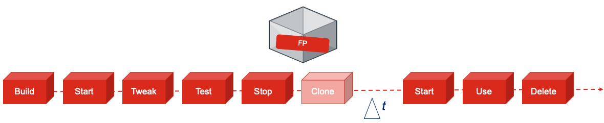

# FortiPoC management toolkit for GCP

<p align="center">
  
</p>

Manage and configure FortiPoC instances on Google Cloud Platform (GCP).
This toolkit (scripts) allow you to manage the workload of creating, configuring and deleting FortiPoc's in a consitent and easy way.

The toolkit allows you to:

* **Handle GCP instances**: Build, Start, Stop, Delete, list (gcpcmd.sh)
* **Tweak FortiPoC**: config changes available per FortiPoC CLI (fpoc-to-all.sh)



## Prerequisites
You will need access to GCP and prepare your local environment

* Active GCP account
* Subscription to your private or company project (billing)
* Computer system capable of running bash shell e.g. Linux, MacOs or Windows + Cygwin/Bash-on-Windows10
* Locally installed `GCP SDK` ([Installing Google Cloud SDK](https://cloud.google.com/sdk/install))
* Locally installed program `parallel` ([Install parallel on Mac OSX](http://macappstore.org/parallel/))

## Obtaining Scripts
You can obtain the latest scripts versions from Gitbub.

## Install
No package installation is needed besides those listed in prerequisites section.
Pull the environment from git or unzip in your prefered working directory.

### Directory and file
The directory structure and files explained

```
 0 drwxr-xr-x  15 fkemps  staff   480B Nov  1 16:22 conf                   << Directory holding fpoc-xxxxx.conf files
 8 -rw-r--r--   1 fkemps  staff   587B Nov  1 16:41 fpoc-example.conf      << Config example created by -c option
16 -rwxr-xr-x   1 fkemps  staff   5.2K Nov  1 16:10 fpoc-to-all.sh         << FortiPoC config tweaking script
32 -rwxr-xr-x   1 fkemps  staff    12K Nov  1 16:40 gcpcmd.sh              << Handling instances on GCP
 0 drwxr-xr-x  30 fkemps  staff   960B Nov  1 21:29 logs                   << Directory holding build log files
```

# Handle GCP Instanced - *gcpcmd.sh*

### Configure
Configuration is embeded in gcpcmd.sh and will happen on first execution, or after `gcpcmd.sh -d | --delete-config`.   
User default settings will be stored in `~/.fpoc/gcpcmd.conf`

```
Welcome to Google Cloud Platform Command tool
Looks like your first run or no defaults available. Let's set them!
Provide your initials : fl
Provide your region 1) Asia, 2) Europe, 3) America : 1
Provide GCP instance label F(irst)LASTNAME e.g. jdoe : flastname
Provide GCP project name : cse-projects-xxxxxx
Provide GCP license server IP : 10.1.1.1
```

### Build Config Template
To create an example config file you can issue `./gcpcmd.sh -c`. This will create a fpoc-example.conf template file which can be use to create workload specific config files. Copy fpoc-example.conf to conf directory with an descriptive name for your workload. You will need this file for the Build option via -c conf/fpoc-fwb-workshop.conf as an example.

```
# Uncomment and speficy to override user defaults
#GCPPROJECT="cse-projects-xxxxxx"
#FPPREPEND="fl"
#LABELS="fortipoc=,flastname="
#LICENSESERVER="10.1.1.1"

# --- edits below this line ---
# Specify FortiPoC instance details.
MACHINETYPE="n1-standard-4"
FPIMAGE="fortipoc-1-7-2-clear"
#FPSIMPLEMENU="enable"
FPTRAILKEY='ES-xamadrid-201907:765eb11f6523382c10513b66a8a4daf5'
#GCPREPO="flastname"
POCDEFINITION1="poc/ferry/FortiWeb-Basic-solution-workshop-v2.2.fpoc"
#POCDEFINITION2="poc/ferry/FortiWeb-Advanced-Solutions-Workshop-v2.5.fpoc"
#POCDEFINITION3=""
#POCDEFINITION4=""
#POCDEFINITION5=""
#POCDEFINITION6=""
#POCDEFINITION7=""
#POCDEFINITION8=""
#POCLAUNCH="FortiWeb Basic solutions"
```

## Managing FortiPoC instances
To control the FortiPoC instances you can use the `gcpcmd.sh` script.   
This allows you to **Build**, **Clone**, **Start**, **Stop**, **Delete** and **list** FortiPoC instances.

### Build
Building will be fully automatic per config file. FortiPoC's will be running with e.g. PoC-definitions loaded, VM images plus documentation prefetched, guest/guest account enabled, GUI title set and optionally a PoC-definition launched.

```
(Version: 2019111101)
Default deployment region: europe-west4-a
Personal instance identification: fk
Default product: test

Usage: ./gcpcmd.sh [-c configfile] <region> <product> <action>
       ./gcpcmd.sh [-c configfile] [region] [product] list
       ./gcpcmd.sh [-c configfile] [region] [product] listpubip
OPTIONS:
        -d    --delete-config     Delete default user config settings
ARGUMENTS:
       region  : asia, europe, america
       product : fwb, fad, fpx, fsw, fsa, sme, xa, appsec, test
       action  : build, start, stop, delete, list, listpubip

[UNKNOWN REGION] Specify: asia, europe  or america
```

### Clone
Under development

### Start / Stop

### Delete


### List

---

# Tweaking FortiPoC Settings - *fpoc-to-all.sh*
Settings of running FortiPoC instances can be tweaked in a consistend and automated way.

The `fpoc-to-all.sh` script allows you to issue CLI commands on a single or multiple FortiPoC's.

```
(Version: 2019110802)
Usage: ./fpoc-to-all.sh OPTION

OPTION: -a    --address       IP-address FortiPoC 192.168.254.1 or multiple via "192.168.254.2 192.168.254.3" space delimitted
        -h    --help          Show script usage and options
        -r    --run           Execute commands on FortiPoC CLI
        -s    --show          Show commands executed on FortiPoC CLI
```

### FortiPoC targets (IP-addresses)

`-a | --address` option allows you to provide dynamically the list of FortiPoC's.   
You can use the `gcpcmd.sh \<region> \<product> listpubip` to generate the list of IP-addresses for the `-a | --address` option.

You can statially provide the list by editing *fpoc-to-all.sh* script and define them in `"IPADDRESS="` parameter.


`-s | --show` option shows the CLI command to be executed on FortiPoC's. This allow you to validate before executing.

`-r | --run` option will execute the commands on FortiPoC's.

### CLI commands to execute


**Disclaimer**   
*Nothing contained in this article is intended to teach or encourage the use of security tools or methodologies for illegal or unethical purposes. Always act in a responsible manner. Make sure you have written permission from the proper individuals before you use any of the tools or techniques described here outside this environment.*
